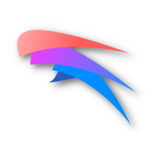

#  Qv2ray - For developers. By developers

[](https://github.com/Shadowsocks-NET/Qv2ray/actions/workflows/build.yml)
[](https://github.com/Shadowsocks-NET/Qv2ray/releases)
[](https://github.com/Shadowsocks-NET/Qv2ray/releases)

[](https://aur.archlinux.org/packages/qv2ray-git/)
[](https://aur.archlinux.org/packages/qv2ray-static-bin-nightly/)

Qv2ray is a cross-platform connection manager for V2Ray and other backends.

This is the original Qv2ray project by the author who contributed over 95% code and other contributors.
Unlike Qv2ray/Qv2ray whose control has been forcibly taken away from the author by another organization owner.

## Development Goal: For developers. By developers

Further development of this project will focus on my own needs and use cases.

Feature requests from non-developers might get rejected. Code contribution is always welcome.

## Compile Dependencies

- Qt 6.2
- CMake 3.20.0 (`cmake_path` command for Windows plugin deployment)
- gRPC, Protobuf (used by `V2RayCorePlugin`, can be omitted if not used)
- OpenSSL (for OpenSSL QtNetwork TLS backend plugin)

## OS Support Status

- ArchLinux: **Tested and Working**
- Windows 10/11: **Tested and Working**, build system.
- macOS 12 Beta: **Tested and Working**
- macOS 11: **Tested and Working**.
- macOS 10.15: **Tested and Working**, build system.
- Ubuntu 20.04: **Untested**, build system.
- Others: **Untested**

> _build system: the CI is done under that OS, although it "should" work there's no runtime guarantee._

## Compatibility

This repo is developed based on the original `dev-v3` branch, so the plugins, configuration
files will not be compatible with the original version.

### Xray

No Such Word In My Dictionary

- 2022-07-19 update: Okay it's now officially a corpse :)

## Plugins At A Glance

~~_Not All Plugins Are Available Since I'm Very Busy_~~

### Built-in Plugins

- **QvPlugin-BuiltinProtocolSupport** Builtin Protocol Support
- **QvPlugin-BuiltinSubscriptionSupport** Builtin Subscription Support
- **QvPlugin-BuiltinUtils** Builtin Utilities

### Utility Plugins

- **QvPlugin-Command** Command Hook Plugin
- **QvPlugin-LatencyTest** Latency Tests Plugin (ICMP, TCP, HTTPS)
- **QvPlugin-Netfilter** Windows Transparent Proxy Plugin

### Protocol Support

- **QvPlugin-Trojan-Go** Trojan-Go Plugin
- **QvPlugin-NaiveProxy** NaiveProxy Plugin

## Licencing

This is free software, and you are welcome to redistribute it under certain conditions.

### Third-party Libraries and Resources

See: [assets/credit.html](assets/credit.html)

Qv2ray is licenced under [](https://www.gnu.org/licenses/gpl-3.0)

```
Qv2ray, A Qt frontend for V2Ray. Written in C++

This program is free software: you can redistribute it and/or modify
it under the terms of the GNU General Public License as published by
the Free Software Foundation, either version 3 of the License, or
(at your option) any later version.

This program is distributed in the hope that it will be useful,
but WITHOUT ANY WARRANTY; without even the implied warranty of
MERCHANTABILITY or FITNESS FOR A PARTICULAR PURPOSE.  See the
GNU General Public License for more details.

You should have received a copy of the GNU General Public License
along with this program.  If not, see <https://www.gnu.org/licenses/>.
```

## Star History


